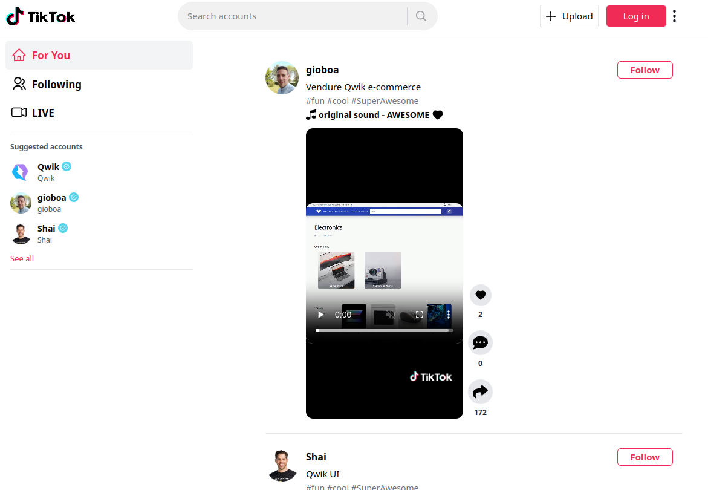
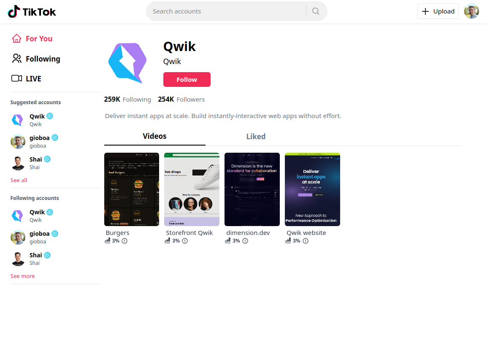
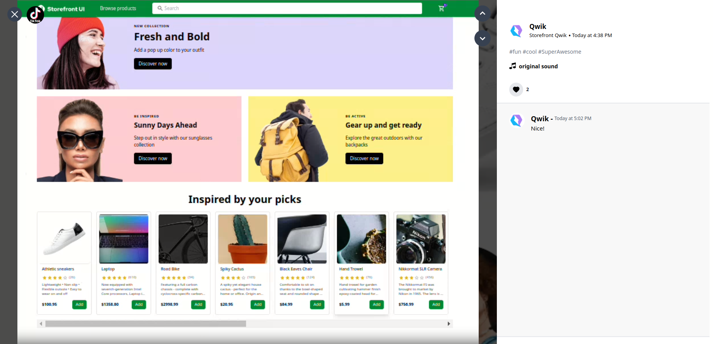
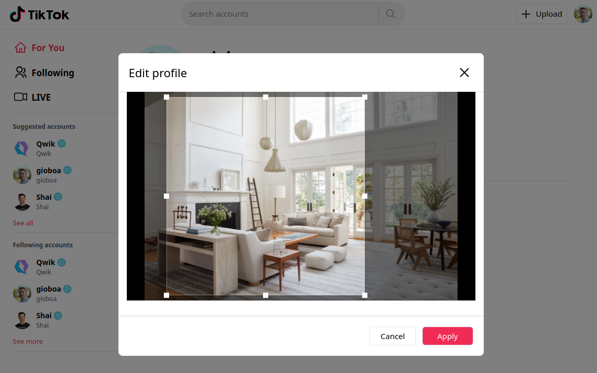
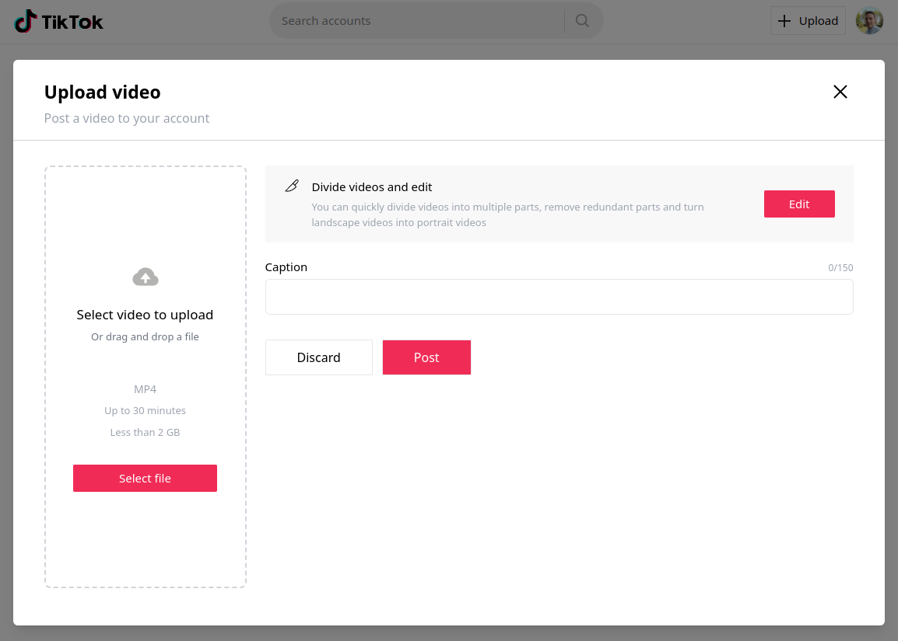

# Qwik TikTok Microfrontends



node >= v20.11.1 required

# The project contains 2 apps ( Host, Upload )

## Host

port: 5173

### Profile page



### Watch post



### Edit profile



## Upload ( vertical split )

port: 5174



## App Setup (localhost)

```
cp .env.example .env
```

You'll have to set up an AppWrite account, and then add all of the details into your .env file.

## AppWrite Schema

### Database Name: tiktok-clone

### Profile Collection:

| Key       | Type   |
| --------- | ------ |
| `image`   | String |
| `bio`     | String |
| `user_id` | String |
| `name`    | String |

Profile Indexes:
| KEY | TYPE | ATTRIBUTE | ASC/DESC |
| ------------- | ------------- | ------------- | ------------- |
| user_id | key | user_id | asc |
| name | fulltext | name | asc |

Profile Settings (Update Permissions):
| Add Role | PERMISSIONS |
| ------------- | ------------- |
| All guests | Read |
| All users | Create, Read, Update, Delete |

### Post Collection:

| Key          | Type   |
| ------------ | ------ |
| `user_id`    | String |
| `video_url`  | String |
| `text`       | String |
| `created_at` | String |

Post Indexes:
| KEY | TYPE | ATTRIBUTE | ASC/DESC |
| ------------- | ------------- | ------------- | ------------- |
| user_id | key | user_id | asc |

Profile Settings (Update Permissions):
| Add Role | PERMISSIONS |
| ------------- | ------------- |
| All guests | Read |
| All users | Create, Read, Update, Delete |

### Like Collection:

| Key       | Type   |
| --------- | ------ |
| `user_id` | String |
| `post_id` | String |

Like Indexes:
| KEY | TYPE | ATTRIBUTE | ASC/DESC |
| ------------- | ------------- | ------------- | ------------- |
| user_id | key | user_id | asc |
| id | unique | id | asc |
| post_id | key | post_id | asc |

Like Settings (Update Permissions):
| Add Role | PERMISSIONS |
| ------------- | ------------- |
| All guests | Read |
| All users | Create, Read, Update, Delete |

### Comment Collection:

| Key          | Type   |
| ------------ | ------ |
| `user_id`    | String |
| `post_id`    | String |
| `text`       | String |
| `created_at` | String |

Comment Indexes:
| KEY | TYPE | ATTRIBUTE | ASC/DESC |
| ------------- | ------------- | ------------- | ------------- |
| post_id | key | post_id | asc |

Comment Settings (Update Permissions):
| Add Role | PERMISSIONS |
| ------------- | ------------- |
| All guests | Read |
| All users | Create, Read, Update, Delete |

## Startup project

Once you've add your AppWrite env variables in the `.env` file, run this command.

`pnpm i`

## Preview server ( run in different terminals )

- `npm run preview:host`
- `npm run preview:upload`

## Development server

Run `npm run serve:all` to run a dev server for each application.

At http://localhost:5173 you can open the host and see the working application.

### Database

### Credits

I did a Next.js to [Qwik](qwik.dev) porting from this repo https://github.com/John-Weeks-Dev/tiktok-clone-nextjs

Thanks @John-Weeks-Dev
